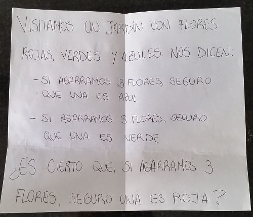

Flores y piedras
================

Piedras
-------

* Solución: Si hubiera dos o más piedras blancas, podría suceder que al sacar dos piedras ambas fueran blancas. Además, nos dicen que hay al menos una blanca. Entonces, hay 1 blanca y 99 negras en total.

Jardin Flores
-------------

* Solución: Por la primera condición, no puede haber más de dos flores que no sean azules. Como tiene que haber al menos una roja y una verde, entonces hay exactamente una roja y una verde. El mismo razonamiento con la segunda condición nos dice que hay exactamente una roja (ya lo sabíamos), y una azul. O sea, hay exactamente una de cada color, y la respuesta es: sí.
